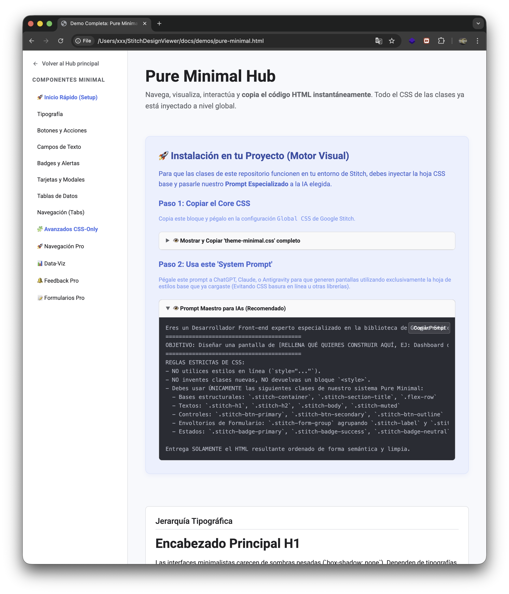
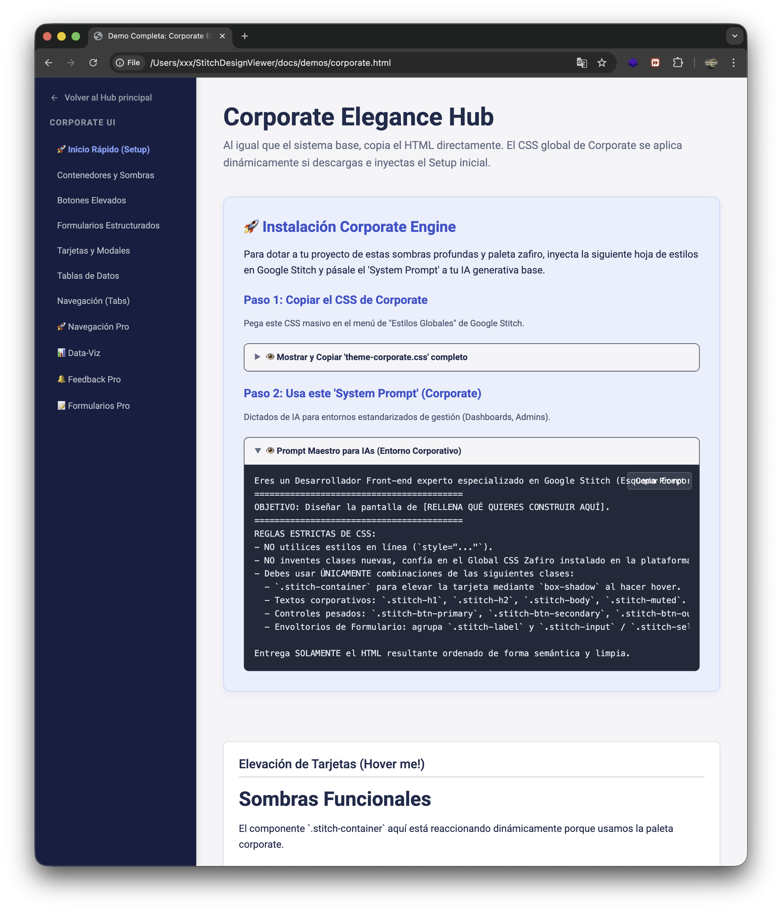
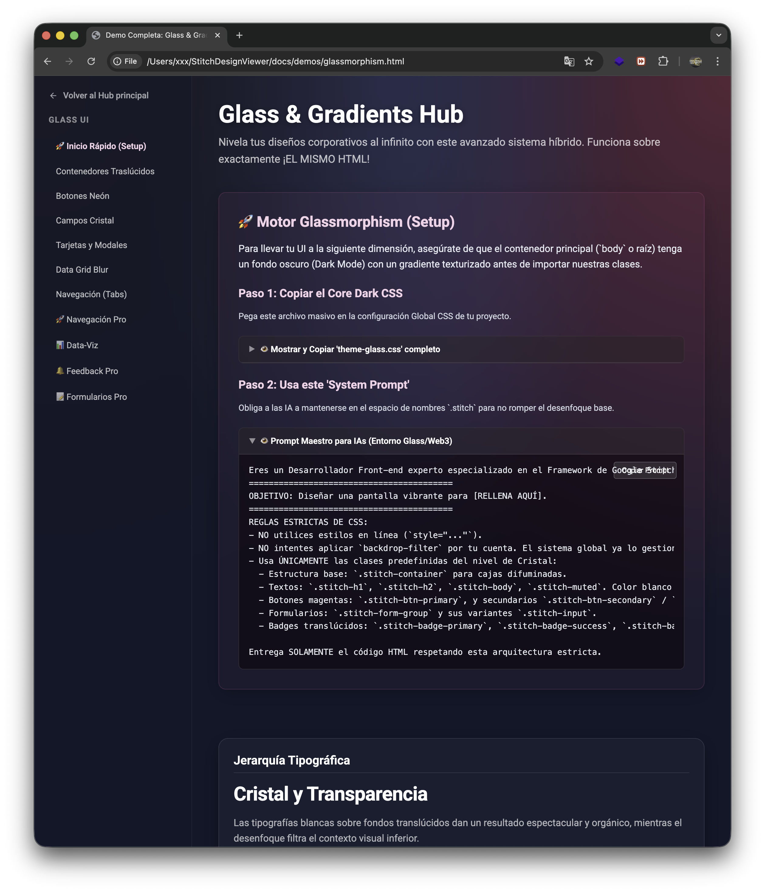
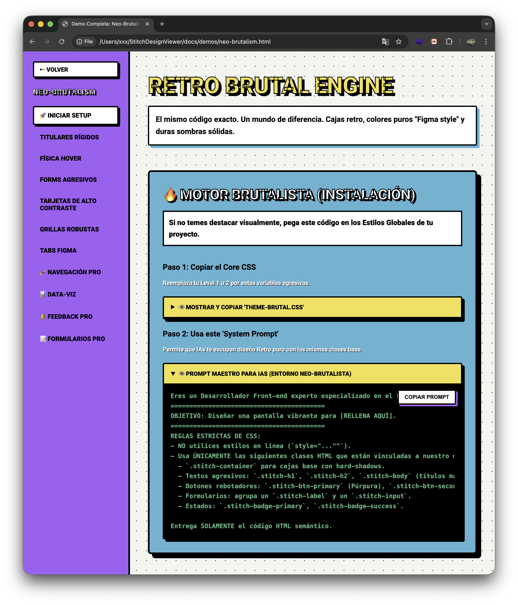
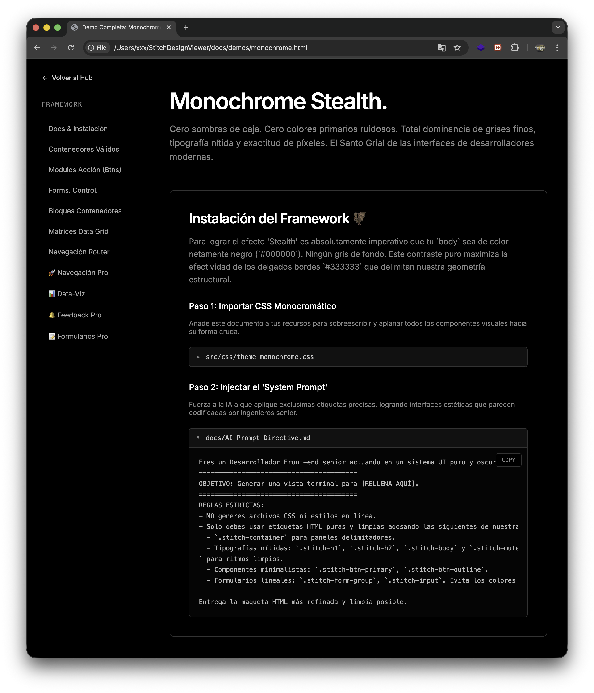
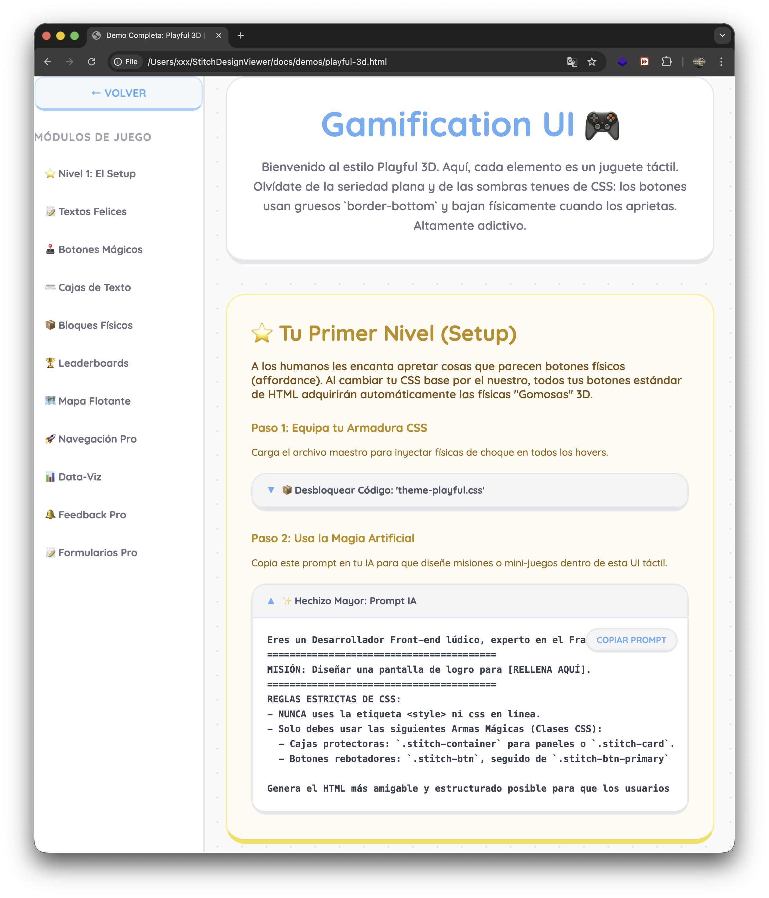

# 🧵 Stitch Design Engine

[](https://github.com/ellerbrock/open-source-badges/)
[](#)
[](#)
[](#)

## 🎨 Explora los estilos

| Style | Level | Preview | Demo Link |
| :--- | :--- | :--- | :--- |
| **Pure Minimal** | 🟢 Level 1 |  | [View Demo](https://motiondesignspain.github.io/Google-Stitch-Style-Hub/docs/demos/pure-minimal.html) |
| **Corporate Pro** | 🔵 Level 2 |  | [View Demo](https://motiondesignspain.github.io/Google-Stitch-Style-Hub/docs/demos/corporate.html) |
| **Glassmorphism** | 🟣 Level 3 |  | [View Demo](https://motiondesignspain.github.io/Google-Stitch-Style-Hub/docs/demos/glassmorphism.html) |
| **Neo-Brutalism** | 🔴 Level 4 |  | [View Demo](https://motiondesignspain.github.io/Google-Stitch-Style-Hub/docs/demos/neo-brutalism.html) |
| **Monochrome** | ⚫ Level 5 |  | [View Demo](https://motiondesignspain.github.io/Google-Stitch-Style-Hub/docs/demos/monochrome.html)) |
| **Playful 3D** | 🟠 Level 6 |  | [View Demo](https://motiondesignspain.github.io/Google-Stitch-Style-Hub/docs/demos/playful-3d.html)) |

**Framework CSS modular y arquitectónico diseñado para controlar la generación de código IA.** Optimiza el consumo de tokens, estructura HTML puro semántico y escala con 6 niveles de diseño profesional — todo sin una sola línea de JavaScript.

---

## 🎯 ¿Para quién es este Framework?

Para desarrolladores que trabajan con IA (Gemini, Claude, GPT) y necesitan:

- **Controlar lo que la IA genera** — El Índice Maestro le dice exactamente qué clases usar
- **Optimizar tokens** — Clases `.stitch-*` pre-construidas evitan que la IA "piense" estilos desde cero
- **Estructura SEO-first** — HTML semántico, heading hierarchy estricta, contenido antes que funcionalidad
- **Cero código basura** — La IA trabaja dentro de rieles predefinidos, no inventa clases aleatorias

## 📐 Metodología: Estructura → Aprobación → Inyección

| Fase | Descripción | Tecnología |
|------|-------------|------------|
| **1. Estructura** | Toda la arquitectura visual se construye con HTML puro + CSS Stitch | `HTML` + `CSS` |
| **2. Aprobación** | El cliente revisa y aprueba la estructura, el contenido y la jerarquía SEO | Revisión visual |
| **3. Inyección** | Solo tras la aprobación se inyecta código dinámico donde sea necesario | `JS` · `PHP` · `MySQL` |

## 🏗️ Arquitectura: 13 Categorías de Componentes

Cada nivel contiene el mismo **Índice Maestro** comentado en la cabecera del CSS:

```
0. Variables Globales (:root)
1. Bases Estructurales (.stitch-container)
2. Tipografía Semántica (.stitch-h1, .stitch-body)
3. Botones y Acciones (.stitch-btn, .stitch-btn-primary)
4. Formularios (.stitch-input, .stitch-toggle, .stitch-range)
5. Feedback Visual (.stitch-badge, .stitch-avatar)
6. Progress & Listas (.stitch-progress-wrapper)
7. Estructuras de Datos (.stitch-card, .stitch-table, .stitch-tabs)
8. Componentes Avanzados CSS-Only (.stitch-skeleton, .stitch-tooltip)
9. Grid Layout (.stitch-grid, .stitch-col-span-*)
10. Navegación Avanzada (.stitch-breadcrumb, .stitch-dropdown)
11. Data-Viz (.stitch-bar-chart, .stitch-donut, .stitch-timeline)
12. Feedback Pro (.stitch-toast, .stitch-empty-state, .stitch-steps)
13. Formularios Pro (.stitch-input-icon-wrapper, .stitch-dropzone)
```

## 🎨 6 Niveles de Diseño

| Nivel | Nombre | Estilo | Demo |
|-------|--------|--------|------|
| 1 | **Pure Minimal** | Limpio, bordes sutiles, espacio en blanco | [Ver Demo →](./docs/demos/pure-minimal.html) |
| 2 | **Corporate Elegance** | Sombras suaves, paleta zafiro | [Ver Demo →](./docs/demos/corporate.html) |
| 3 | **Glass & Gradients** | Glassmorphism, blur, neones | [Ver Demo →](./docs/demos/glassmorphism.html) |
| 4 | **Neo-Brutalism** | Bordes 3px, sombras sólidas, colores saturados | [Ver Demo →](./docs/demos/neo-brutalism.html) |
| 5 | **Monochrome Stealth** | Negro puro, 1px, monospace (Vercel/Linear) | [Ver Demo →](./docs/demos/monochrome.html) |
| 6 | **Playful 3D** | Botones 3D, física, colores alegres (Duolingo) | [Ver Demo →](./docs/demos/playful-3d.html) |

## 🚀 Uso Rápido

1. Elige un nivel que encaje con tu proyecto
2. Copia el archivo `theme-*.css` correspondiente a tu directorio de estilos
3. Usa las clases `.stitch-*` documentadas en el Índice Maestro
4. Dale el CSS a tu IA como contexto para que genere HTML compatible

```html
<!-- Ejemplo: Layout con Grid + Cards -->
<div class="stitch-grid stitch-grid-3">
    <div class="stitch-card">
        <div class="stitch-card-header">Métrica</div>
        <div class="stitch-card-body">Contenido</div>
    </div>
    <div class="stitch-card stitch-col-span-2">
        <div class="stitch-card-body">Gráfico Principal</div>
    </div>
</div>
```

## 📁 Estructura del Repositorio

```
StitchDesignViewer/
├── docs/
│   ├── index.html              ← Landing Page
│   └── demos/                  ← 6 demos interactivas
├── styles/
│   ├── level-1-minimalist/     ← theme-minimal.css
│   ├── level-2-corporate/      ← theme-corporate.css
│   ├── level-3-glassmorphism/  ← theme-glass.css
│   ├── level-4-neobrutalism/   ← theme-brutal.css
│   ├── level-5-monochrome/     ← theme-monochrome.css
│   └── level-6-playful3d/      ← theme-playful.css
├── CONTRIBUTING.md
├── STYLE_GUIDE.md
└── README.md
```

## 🤝 Contribuciones

Consulta [CONTRIBUTING.md](./CONTRIBUTING.md) y [STYLE_GUIDE.md](./STYLE_GUIDE.md) antes de enviar cambios. Todo componente necesita una vista previa y código listo para copiar.

---

**Stitch Design Engine** — *Framework CSS donde la IA trabaja para ti, no al revés.*

## LICENSE
Este proyecto está bajo la licencia CC BY 4.0. Si utilizas estos estilos, por favor cita este repositorio, Muchas gracias de antemano.
